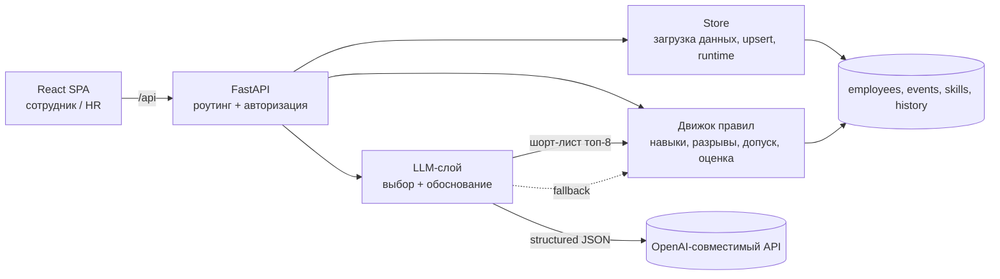

# Career Quest — AI-навигатор развития сотрудника

Career Quest решает задачу трека **Halyk Bank / HackAlem AI (Кейс 1)**: превратить
разрозненный поток HR-событий в понятную траекторию роста с объяснимой
рекомендацией следующего шага.

Ядро проекта — **качество и объяснимость рекомендации**: решение опирается не на
один признак («самый слабый навык»), а на грейд, фактический уровень навыков,
разрывы до целевого грейда, историю участия, предусловия и доступность. Поверх
детерминированного движка работает **LLM-слой**, который выбирает 1–3 активности
из шорт-листа движка и формулирует обоснование на языке сотрудника.

---

## 1. Какую проблему решаем и для кого

Сотрудник получает поток HR-активностей без связи с его карьерной целью и
требованиями следующего грейда. В результате обучение проходят «для галочки», а
на добровольные активности низкая явка, хотя бюджет развития расходуется полностью.

- **Основной пользователь** — сотрудник с опытом 1–5 лет: видит профиль и
  траекторию, получает рекомендацию следующего шага с обоснованием, отмечает
  выполнение и видит, как сдвинулся прогресс.
- **Второй пользователь** — HR: видит, какие компетенции проседают чаще всего, у
  кого нет рекомендованного шага и как проходит участие по активностям.

## 2. Что реализовано

- **Профиль и карьерная траектория.** Роль, грейд, стаж, цель; лестница грейдов
  Junior → Middle → Senior → Lead с текущим и целевым; готовность к целевому
  грейду в %, критические навыки «met x/y», навыки vs требования цели.
- **AI-рекомендация 1–3 шагов** с обоснованием, опирающимся минимум на 3 фактора
  (грейд, разрывы навыков, история участия, требования следующего уровня,
  предусловия, доступность, устаревшая аттестация).
- **Прозрачный расчёт.** По каждой рекомендации — список факторов с реальными
  числами, ожидаемый прирост навыков, вклад в готовность, а также блок «почему не
  наивный выбор» (сравнение с правилом «самый слабый навык»).
- **Обновление прогресса.** Отметка «выполнено» пересчитывает навыки, готовность,
  траекторию и рекомендации.
- **HR-обзор:** проседающие компетенции, сотрудники без рекомендованного шага (с
  причиной и подсказкой), участие по активностям с флагом оттока, приватный сигнал
  снижения вовлечённости.
- **Импорт данных жюри** через интерфейс HR (upsert по id, устойчивый к плохим
  строкам).
- **Локализация** обоснования и интерфейса: `kk` / `ru` / `en`.
- **Разграничение прав** сотрудник/HR, приватность вовлечённости, запуск одной
  командой, работа без ключа LLM (режим правил).
- **«Спросите о своём пути».** Вопрос в свободной форме («почему это, а не мой
  самый слабый навык?») — ответ LLM строго по фактам профиля, без выдуманных чисел.
- **Риск ухода** в HR-обзоре — объяснимый балл 0–100 с причинами (отказы, просрочки,
  нет прогресса, нет цели). Повод для разговора, не рейтинг.
- **Лёгкая геймификация.** XP только за добровольные активности и закрытые
  критические навыки; приватно, без лидербордов.
- **Лендинг продукта** (`/`): «живая» hero-карточка на реальных данных, «Путь» по
  грейдам, сравнение «наивное правило vs Career Quest», интерактивное «Отметить
  выполненным», HR-превью, KK/RU/EN, тёмная тема и входы в демо-профили.

## 3. Как работает основной сценарий

0. Лендинг `/` → «Открыть демо-профиль» (или `/app` — выбор профиля, без пароля).
1. Вход как сотрудник (демо-выбор профиля, без пароля) → `GET /api/employees/{id}`
   строит профиль: применяет к аттестованным навыкам активности, завершённые
   **после даты последней аттестации** (эффективный уровень), определяет цель и
   разрывы.
2. `GET /api/employees/{id}/recommendations?mode=ai&lang=ru` → движок формирует
   шорт-лист и оценки, LLM выбирает 1–3 шага и пишет обоснование; при недоступности
   LLM интерфейс мгновенно показывает результат режима правил.
3. Сотрудник отмечает активность выполненной → `POST /api/employees/{id}/activities`
   пересчитывает навыки и готовность и возвращает новую рекомендацию.
4. HR открывает `GET /api/hr/overview` и, при необходимости, загружает профили
   жюри через `POST /api/hr/import`.

## 4. Алгоритм рекомендации (детерминированное ядро + LLM)

**Эффективный уровень навыка.** К аттестованному уровню применяются только
завершённые активности с датой позже `last_review_date`, по порядку дат:
`new = max(cur, min(cur + gain, max_level))`. Такие навыки помечаются «на пересмотре».

**Цель.** `career_goal`, если задан и отличается от текущей роли/грейда, иначе
следующий грейд той же роли. Lead без цели → рекомендаций нет (`AT_TOP_NO_GOAL`).

**Разрыв.** `gap = max(0, required_target − effective)`. Критические навыки целевого
грейда имеют вес 3, остальные — 1.

**Допуск активности** (все условия): не обязательная (mandatory назначает HR);
подходит роль и грейд; выполнены предусловия по эффективным уровням; не завершена
ранее (исключение — регулярный клуб `EV_036`); доступна (self-paced или есть
будущая сессия); развивает хотя бы один навык с разрывом, причём `effective < max_level`.

**Оценка** (каждое число видно в интерфейсе):

```
gap_value    = Σ w·min(прирост, разрыв) / Σ w·разрыв     # доля закрытого взвешенного разрыва
propensity   = (1 + позитив) / (2 + позитив + негатив)    # по похожим активностям, ×0.5 старше 12 мес
fit          = доля завершения формата (× 0.7 если remote и активность offline)
availability = 1.0 (self-paced / сессия ≤ 45 дн) · 0.8 (≤ 90 дн) · 0.5 (позже)
score        = gap_value · (0.5 + 0.5·propensity) · fit · availability
```

Отбор — жадный, с диверсификацией (×0.5, если основной навык уже закрыт другой
рекомендацией), максимум 3. При ≥3 отказах/неявках на похожем формате движок
предпочитает другой формат. Пустой результат кодируется:
`AT_TOP_NO_GOAL`, `TARGET_REACHED`, `NO_ELIGIBLE_EVENTS`, `PREREQUISITES_BLOCKED`,
`LOW_ENGAGEMENT`.

**LLM-слой.** Получает шорт-лист топ-8 кандидатов с факторами, разрывы (с пометкой
критичных), статистику участия, наивный baseline и язык. Возвращает строгий JSON:
1–3 выбора, каждое обоснование ссылается минимум на 3 реальных фактора кандидата.
Ответ валидируется (id ∈ шорт-лист, ≥3 различных типов факторов); при ошибке —
одна повторная попытка, затем **fallback на режим правил** с шаблонным обоснованием.
Результаты кэшируются по `(сотрудник, состояние, язык)`.

## 5. Технологии

- **Backend:** Python 3.11, FastAPI, Pydantic v2, Uvicorn, `openai` (совместимый с
  OpenAI API клиент), pytest. Данные — в памяти, среда выполнения пишет в `data/runtime/`.
- **AI:** LLM через OpenAI-совместимый эндпоинт, по умолчанию `gpt-4.1-mini`
  (structured outputs, strict JSON). Работает и без ключа (режим правил).
- **Frontend:** React 18, Vite, TypeScript, Tailwind CSS, Recharts, React Router.
- **Инфраструктура:** один многостадийный `Dockerfile` (node собирает SPA →
  python отдаёт `/api/*` и собранный SPA), `docker compose`, `Makefile`.

## 6. Архитектура



- **Store** — единый источник данных: загружает стартовый набор, `data/extra`,
  `data/test_profiles`, `data/runtime`; импорт и отметки выполнения обновляют
  данные и пересобирают представление движка.
- **Движок** (`app/engine/`) — чистый Python без FastAPI: `dataset`, `skills`,
  `candidates`, `recommender`.
- **LLM-слой** (`app/llm/`) — `client`, `prompt`, `decide`; полностью опционален.
- **API** (`app/api/`) — эндпоинты и мост к движку/LLM; **HR-аналитика** — `app/hr/`.

Основные эндпоинты: `POST /api/auth/login`, `GET /api/demo/people`,
`GET /api/employees/{id}`, `GET /api/employees/{id}/recommendations?mode=&lang=`,
`POST /api/employees/{id}/activities`, `GET /api/catalog`,
`GET /api/hr/overview`, `GET /api/hr/employees`, `POST /api/hr/import`,
`POST /api/employees/{id}/ask`, `POST /api/landing/events`, `GET /api/health`.

### Лендинг

- Код — `frontend/src/landing/` (React, без сторонних UI-китов); спецификация
  дизайна — [`docs/LANDING.md`](docs/LANDING.md).
- **Все числа на лендинге — из продукта.** `backend/scripts/export_landing_fixtures.py`
  прогоняет движок и API на чистой копии данных и пишет
  `frontend/src/landing/fixtures.json` (карточка E0028 с AI-обоснованием на трёх
  языках, ловушка против наивного правила, HR-превью только с инициалами, метрики).
  `backend/scripts/render_og_image.py` рисует превью для соцсетей `frontend/public/og.png`.
- Страницы кабинета загружаются лениво, поэтому лендинг не тянет графики
  (~83 КБ JS в gzip). `prefers-reduced-motion` и тёмная тема учитываются.
- Аналитика — только два анонимных события (`demo_opened`, `contact_clicked`) в
  `data/runtime/landing_events.jsonl`; сторонних трекеров нет, лишние поля отклоняются.

## 7. Установка и запуск

### Вариант A — одна команда (Docker)

```bash
docker compose up --build
```

Откроется на **http://localhost:8000** (API и интерфейс с одного сервера).
Работает без ключа LLM. Чтобы включить AI-режим, создайте `.env` рядом с
`docker-compose.yml`:

```bash
LLM_API_KEY=sk-...
LLM_MODEL=gpt-4.1-mini
```

> Порт 8000 должен быть свободен. Переопределить: `docker compose run --service-ports -p 8010:8000 app`.

### Вариант B — локальная разработка

```bash
# backend
cd backend
python -m venv .venv && source .venv/bin/activate
pip install -r requirements.txt
PYTHONPATH=. uvicorn app.main:app --reload --port 8000

# frontend (в отдельном терминале)
cd frontend
npm install
npm run dev        # http://localhost:5173, проксирует /api на :8000
```

Тесты: `cd backend && pytest -q`. Оценка на trap-профилях: `python eval/run_eval.py`.

### Маршруты

| Путь | Что открывается |
|---|---|
| `/` | лендинг продукта |
| `/app` | вход в демо (сотрудник или HR, без пароля) |
| `/app?demo=E0028` · `/app?role=hr` | сразу нужный кабинет (глубокие ссылки с лендинга) |
| `/me/{id}` · `/hr` | кабинет сотрудника · HR-обзор |

## 8. Как проверить решение (сценарий для жюри)

0. **Лендинг.** Откройте http://localhost:8000 — hero-карточка показывает реальную
   рекомендацию для E0028 (AI-обоснование на KK/RU/EN), раздел «Почему это, а не то»
   — ловушку публичных выступлений. Кнопка «Открыть демо-профиль» ведёт в кабинет.
1. **Импорт профилей жюри.** Вход как **HR** → раздел «Import profiles & history» →
   загрузить `employees.json` / `activity_history.csv` (формат стартового набора) →
   отчёт покажет добавленные записи.
2. **Объяснимая рекомендация.** Вход как сотрудник (например, **E0028**, Backend
   Engineer · Middle → Senior): видны траектория, готовность, критические навыки,
   1–3 рекомендации с факторами (реальные числа) и блок «почему не самый слабый навык».
3. **Обновление прогресса.** «Отметить выполненным» → навык и готовность
   сдвигаются, появляется новая рекомендация.
4. **HR-обзор:** проседающие компетенции, список без рекомендованного шага с
   подсказками, участие по активностям с флагами оттока.
5. **Устойчивость к «ловушкам».** `python eval/run_eval.py` — 8 синтетических
   профилей, на которых однофакторное правило ошибается; движок корректен на всех 8.

Проверка API без интерфейса:

```bash
curl -s localhost:8000/api/health
TOKEN=$(curl -s localhost:8000/api/auth/login -H 'content-type: application/json' \
  -d '{"role":"employee","employee_id":"E0028"}' | python3 -c 'import sys,json;print(json.load(sys.stdin)["token"])')
curl -s "localhost:8000/api/employees/E0028/recommendations?mode=ai&lang=ru" \
  -H "Authorization: Bearer $TOKEN"
```

### Результаты оценки на trap-профилях

Движок корректен на **8/8**; наивный baseline «самый слабый навык» расходится с
движком на профилях, где он рекомендует отклонённую, заблокированную,
«упёршуюся в потолок» или уже закрытую активность (подробности и таблица —
[`eval/RESULTS.md`](eval/RESULTS.md)).

## 9. Данные и интеграции

- **Стартовый набор** (`data/`): `employees.json` (200), `events.json` (40),
  `skills.json` (60 навыков, требования по грейдам), `activity_history.csv`
  (2 743 записи). Дата «сегодня» — `meta.as_of_date` (2026-10-01), а не системные часы.
- **Синтетические trap-профили** (`data/test_profiles/`, E9001–E9008) для оценки.
- **Внешний сервис:** OpenAI-совместимый API для LLM-слоя (опционально; конфиг
  через переменные окружения).

| Переменная | Назначение | По умолчанию |
|---|---|---|
| `LLM_API_KEY` | ключ; пусто → режим правил | пусто |
| `LLM_BASE_URL` | эндпоинт (пусто → OpenAI) | пусто |
| `LLM_MODEL` | модель | `gpt-4.1-mini` |
| `LLM_TIMEOUT_S` | таймаут запроса, сек | `8` |

Приватность и безопасность: внутренний контур; данные вовлечённости не видны
другим сотрудникам; права сотрудник/HR разграничены на сервере (чужой профиль и
HR-маршруты → 403); ключи не коммитятся (`.env` в `.gitignore` и `.dockerignore`);
нет публичных рейтингов сотрудников; нет механик вокруг обязательных процессов.

## 10. Ограничения

- Данные — синтетические, живут в памяти; постоянное хранилище не подключено
  (среда выполнения пишет CSV/JSONL в `data/runtime/`).
- Демо-авторизация без пароля (подписанный токен с ролью); не для продакшена.
- AI-режим требует ключа и сетевого доступа; при их отсутствии используется режим
  правил (это штатное поведение, а не ошибка).
- Отметки выполнения в `data/runtime/` сохраняются между перезапусками — перед
  «чистой» демонстрацией каталог можно очистить.
- Данные лендинга — снимок: после изменения данных или движка перегенерируйте
  `python backend/scripts/export_landing_fixtures.py` (и `render_og_image.py`).
- Оценка задержки: интерфейс/правила — десятки мс, AI-рекомендация — ~2–5 с.

## 11. Deployed-версия

Публичного развёртывания нет — запуск локально одной командой (раздел 7).
